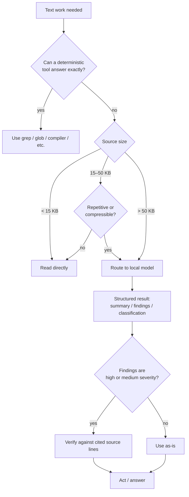

# local-model-routing

**A Claude Code skill that routes large, repetitive, or bounded text work to a local model first — so Claude only pays context for what actually matters.**

[](https://github.com/anthropics/claude-code)
[]()

**English | [简体中文](README.zh-CN.md)**

---

## Install

```bash
curl -fsSL https://raw.githubusercontent.com/Jiayi0111/claude-local-model-routing-skill/main/install.sh | bash
```

This copies `SKILL.md` into `~/.claude/skills/local-model-routing/`. Restart Claude Code (or start a new session) and the skill is live — there's nothing to invoke manually, Claude applies the routing rules automatically once it decides they fit.

Prefer to do it by hand?

```bash
mkdir -p ~/.claude/skills/local-model-routing
curl -fsSL https://raw.githubusercontent.com/Jiayi0111/claude-local-model-routing-skill/main/skills/local-model-routing/SKILL.md \
  -o ~/.claude/skills/local-model-routing/SKILL.md
```

> **Requirement:** this skill only supplies the *routing logic*. It assumes an MCP server already exposes a preprocessing tool (path, task, focus, `max_output_tokens` in → structured JSON out) backed by a local model. If you don't have one configured yet, set that up first — the skill has nothing to route to without it.

### Don't have a local model yet?

The fastest path is [Ollama](https://ollama.com) running on your own machine:

```bash
# 1. install Ollama, then pull a small instruct model
brew install ollama              # or the installer from ollama.com
ollama pull qwen2.5-coder:7b     # ~4-5 GB, enough for summarize/classify/extract

# 2. confirm it's up
ollama list
curl -s http://localhost:11434/api/tags
```

Ollama itself isn't an MCP server — it just serves models over a local HTTP API. You still need a thin MCP server in front of it exposing one tool that matches the contract this skill's routing logic is written against:

| Param | Type | Notes |
|---|---|---|
| `path` | string, required | absolute path to the file to process |
| `task` | enum, default `summarize` | `summarize` \| `classify` \| `inspect` \| `extract` \| `dedupe` \| `rewrite` \| `summarize-diff` \| `assess-value` |
| `focus` | string, optional | target / fields / severity filter for the task |
| `max_output_tokens` | int, default 1200 (200–2000) | output budget |

A minimal reference bridge (~35 lines, Python — `pip install mcp requests`) is enough to get unblocked:

```python
import requests
from mcp.server.fastmcp import FastMCP

mcp = FastMCP("local-llm")
OLLAMA_URL = "http://localhost:11434/api/generate"
MODEL = "qwen2.5-coder:7b"

TASK_PROMPTS = {
    "summarize": "Summarize the key facts, errors, and next actions.",
    "inspect": "Map responsibilities, dependencies, risks, and locations.",
    "classify": "Classify records into categories with counts.",
    "extract": "Extract only facts/fields relevant to the focus.",
    "dedupe": "Find exact and probable duplicate groups. Do not delete anything.",
    "rewrite": "Produce a shorter, meaning-preserving version.",
    "summarize-diff": "Summarize behavior changes, risks, and missing tests.",
    "assess-value": "Say whether this file is worth reading: all, part, or none.",
}

@mcp.tool()
def preprocess_large_input(path: str, task: str = "summarize", focus: str = "", max_output_tokens: int = 1200) -> str:
    text = open(path, encoding="utf-8", errors="replace").read()
    prompt = f"{TASK_PROMPTS[task]}\nFocus: {focus or 'none'}\n\n{text}"
    resp = requests.post(OLLAMA_URL, json={
        "model": MODEL, "prompt": prompt, "stream": False,
        "options": {"num_predict": max_output_tokens},
    })
    return resp.json()["response"]

if __name__ == "__main__":
    mcp.run()
```

Register it with Claude Code:

```bash
claude mcp add local-llm -- python3 /path/to/bridge.py
```

> If you point this at **Ollama Cloud** instead of a fully local model, requests leave your machine — check your own data-handling policy before routing sensitive content there, same as the [Guardrails](#guardrails) below.

---

## Why

Every large file Claude reads directly costs context — context that isn't available for reasoning, editing, or holding the rest of the conversation. Most of that content is either boilerplate, repetitive, or irrelevant to the actual question. This skill inserts a cheap triage step: a local model reads the full source and hands Claude a small, structured, verifiable result instead.

Claude still does all the reasoning, all the edits, and all the verification. The local model only compresses — it never decides, never edits, never gets trusted blindly.

## Feature highlights

| Feature | What it does |
|---|---|
| **Size-tiered routing** | Below 15 KB → direct read. 15–50 KB → local model only when clearly repetitive or compressible. Above 50 KB → local model by default. |
| **8 narrow task types** | `summarize`, `inspect`, `classify`, `extract`, `dedupe`, `rewrite`, `summarize-diff`, `assess-value` — each shaped for one job instead of one generic "read this" prompt. |
| **Adaptive output budget** | `max_output_tokens` scales with the task (600–800 for a quick dedupe, up to 2000 for a broad inspect) instead of one-size-fits-all. |
| **Severity-focused findings** | Ask for "high/medium only" up front so low-value findings never make it into Claude's context to begin with. |
| **Untrusted-lead verification** | Every result is treated as a lead, not a fact — high/medium findings get checked against real source lines before anything is acted on. |
| **File triage mode** | `assess-value` tells Claude whether a candidate file is worth reading at all, in bulk, across many files in one turn. |
| **Optional Haiku handoff** | In environments with model-selectable subagents, bounded exploration or draft work can go to a cheaper subagent instead, with explicit boundaries and verification. |

## How it decides



## How much context it actually saves

Rough model: **1 token ≈ 4 characters**. A routed call costs a near-fixed summary (~1,200 tokens for a typical `inspect`/`summarize`) plus a *targeted* re-read of only the findings worth verifying — it does not scale 1:1 with file size the way a direct read does.

| Source size | Direct read (Claude context) | Via this skill (summary + targeted verify) | Net savings |
|---|---|---|---|
| 10 KB | ~2,500 tokens | *(below floor — direct read is used, by design)* | 0% |
| 26 KB | ~6,500 tokens | ~2,150 tokens | **~67%** |
| 50 KB | ~12,500 tokens | ~3,050 tokens | **~76%** |
| 100 KB | ~25,000 tokens | ~4,900 tokens | **~80%** |
| 250 KB+ | ~62,500 tokens | *(narrow the focus / split input instead of one giant call)* | — |

```
Direct read   (26 KB)  ██████████████████████████████████  ~6,500 tokens
Skill-routed  (26 KB)  ████████████                         ~2,150 tokens   (-67%)
```

**Break-even point:** because the summary cost is nearly fixed while the direct-read cost grows linearly with size, the crossover sits close to the skill's own 15 KB floor — a 15 KB direct read (~3,750 tokens) is already in the same range as a processed-and-verified result (~1,700–2,000 tokens). That's *why* the floor is set there instead of lower: below it, the fixed overhead of a routed call (tool invocation + a ~1,200-token summary) isn't reliably worth it against just reading a small file. Above it, savings grow and compound with every additional large file in the same session.

These numbers are illustrative, based on the routing logic's own assumptions — not a benchmark. Actual savings depend on how compressible your content is and how much verification a given answer needs.

## Guardrails

- The routed model is **read-only** — never asked to edit files, run commands, deploy, or make security-sensitive calls.
- Treat every result as an **untrusted lead**: verify anything that matters against real source before acting on it.
- If your content is sensitive, confidential, or regulated, check your own data-handling policy before routing it through *any* external model endpoint — this skill doesn't make that decision for you.

## Customize

Everything above lives in one file: [`skills/local-model-routing/SKILL.md`](skills/local-model-routing/SKILL.md). Common tweaks:
- Move the size thresholds if your typical files/tokens differ from the assumptions above.
- Change the default severity focus for `inspect` / `summarize-diff` / `assess-value`.
- Point it at whatever local model runtime you use.

## Contributing

Issues and PRs welcome — this is a small, single-purpose skill and easy to read end-to-end before changing.
