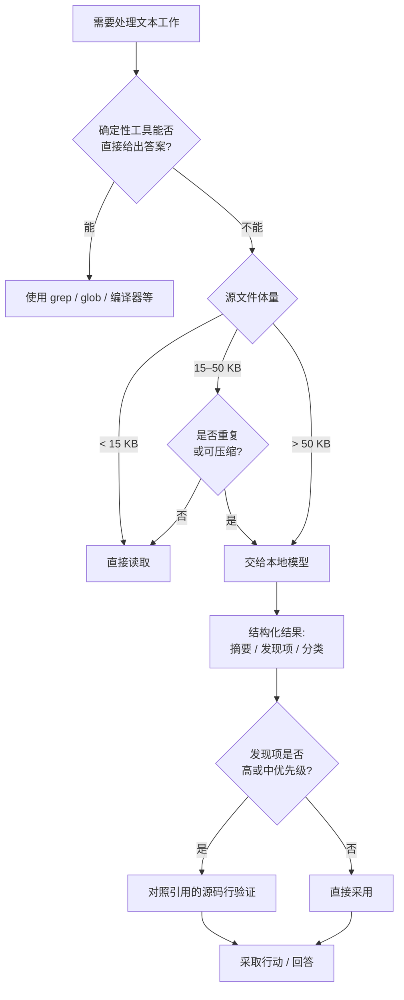

# local-model-routing

**一个 Claude Code 技能,会先把体量大、重复性高或范围明确的文本工作交给本地模型处理——让 Claude 只为真正重要的部分消耗上下文。**

[](https://github.com/anthropics/claude-code)
[]()

**[English](README.md) | 简体中文**

---

## 安装

```bash
curl -fsSL https://raw.githubusercontent.com/Jiayi0111/claude-local-model-routing-skill/main/install.sh | bash
```

这条命令会把 `SKILL.md` 复制到 `~/.claude/skills/local-model-routing/`。重启 Claude Code(或开启新会话)后技能即可生效——不需要手动调用,Claude 会在判断适用时自动应用这些路由规则。

想手动安装?

```bash
mkdir -p ~/.claude/skills/local-model-routing
curl -fsSL https://raw.githubusercontent.com/Jiayi0111/claude-local-model-routing-skill/main/skills/local-model-routing/SKILL.md \
  -o ~/.claude/skills/local-model-routing/SKILL.md
```

> **前提条件:** 这个技能只提供*路由逻辑*本身。它假设你已经有一个 MCP server 提供了预处理工具(输入 path、task、focus、`max_output_tokens`,输出结构化 JSON),背后由某个本地模型支撑。如果还没配置好,请先搭建——否则这个技能没有可以路由的对象。

### 没有本地模型？

最快的路径是在自己的机器上跑 [Ollama](https://ollama.com)：

```bash
# 1. 安装 Ollama，再拉一个小的指令模型
brew install ollama              # 或用 ollama.com 提供的安装包
ollama pull qwen2.5-coder:7b     # 约 4-5 GB，足够 summarize/classify/extract 用

# 2. 确认已经跑起来
ollama list
curl -s http://localhost:11434/api/tags
```

Ollama 本身不是 MCP server——它只是把模型通过本地 HTTP API 提供出来。你还需要在它前面架一个很薄的 MCP server，暴露一个符合本技能路由逻辑所依赖的契约的工具：

| 参数 | 类型 | 说明 |
|---|---|---|
| `path` | 字符串，必填 | 待处理文件的绝对路径 |
| `task` | 枚举，默认 `summarize` | `summarize` \| `classify` \| `inspect` \| `extract` \| `dedupe` \| `rewrite` \| `summarize-diff` \| `assess-value` |
| `focus` | 字符串，可选 | 该任务的目标 / 字段 / 严重程度过滤条件 |
| `max_output_tokens` | 整数，默认 1200(200–2000) | 输出预算 |

一份最小的参考桥接实现(约 35 行 Python，`pip install mcp requests`)就足够先跑起来：

```python
import requests
from mcp.server.fastmcp import FastMCP

mcp = FastMCP("local-llm")
OLLAMA_URL = "http://localhost:11434/api/generate"
MODEL = "qwen2.5-coder:7b"

TASK_PROMPTS = {
    "summarize": "Summarize the key facts, errors, and next actions.",
    "inspect": "Map responsibilities, dependencies, risks, and locations.",
    "classify": "Classify records into categories with counts.",
    "extract": "Extract only facts/fields relevant to the focus.",
    "dedupe": "Find exact and probable duplicate groups. Do not delete anything.",
    "rewrite": "Produce a shorter, meaning-preserving version.",
    "summarize-diff": "Summarize behavior changes, risks, and missing tests.",
    "assess-value": "Say whether this file is worth reading: all, part, or none.",
}

@mcp.tool()
def preprocess_large_input(path: str, task: str = "summarize", focus: str = "", max_output_tokens: int = 1200) -> str:
    text = open(path, encoding="utf-8", errors="replace").read()
    prompt = f"{TASK_PROMPTS[task]}\nFocus: {focus or 'none'}\n\n{text}"
    resp = requests.post(OLLAMA_URL, json={
        "model": MODEL, "prompt": prompt, "stream": False,
        "options": {"num_predict": max_output_tokens},
    })
    return resp.json()["response"]

if __name__ == "__main__":
    mcp.run()
```

把它注册进 Claude Code：

```bash
claude mcp add local-llm -- python3 /path/to/bridge.py
```

> 如果你接的是 **Ollama Cloud** 而不是完全本地的模型，请求会离开你的机器——在把敏感内容路由过去之前，先核实自己的数据处理政策，和下面的[安全边界](#安全边界)是同一个道理。

---

## 为什么需要它

Claude 直接读取的每一个大文件都会消耗上下文——而这部分上下文本可以用来推理、编辑,或维持对话的其余部分。这些内容大多是模板化、重复,或者与实际问题无关的。这个技能插入了一个低成本的分诊步骤:本地模型读取完整源内容,把一份精简、结构化、可验证的结果交给 Claude。

Claude 依然负责全部的推理、全部的编辑、全部的验证。本地模型只负责压缩——它从不做决定,从不编辑,也从不会被盲目信任。

## 功能亮点

| 功能 | 作用 |
|---|---|
| **按体量分级路由** | 低于 15 KB → 直接读取。15–50 KB → 只有在明显重复或可压缩时才交给本地模型。高于 50 KB → 默认交给本地模型。 |
| **8 种精细任务类型** | `summarize`、`inspect`、`classify`、`extract`、`dedupe`、`rewrite`、`summarize-diff`、`assess-value`——每种都为单一任务定制,而不是一个万能的"读一下这个"提示。 |
| **自适应输出预算** | `max_output_tokens` 会根据任务调整(快速去重 600–800,大范围排查最多 2000),而不是一刀切。 |
| **按严重程度聚焦发现项** | 提前要求"只要高/中优先级",低价值的发现项一开始就不会进入 Claude 的上下文。 |
| **"未经验证线索"式验证** | 每个结果都被当作线索,而非事实——高/中优先级的发现项会先对照真实源码行验证,再采取任何行动。 |
| **文件价值分诊模式** | `assess-value` 会告诉 Claude 某个候选文件是否值得读——可以一次性对多个文件批量判断。 |
| **可选的 Haiku 交接** | 在支持可选模型子代理的环境中,范围明确的探索或草稿工作可以交给更便宜的子代理,并附带明确边界和验证要求。 |

## 决策流程



## 实际能节省多少上下文

粗略估算:**1 token ≈ 4 个字符**。一次路由调用的成本近似固定(典型的 `inspect`/`summarize` 约 1,200 tokens),再加上对*真正需要验证*的发现项进行有针对性的重读——它不会像直接读取那样随文件体量线性增长。

| 源文件体量 | 直接读取(Claude 上下文) | 通过本技能(摘要 + 针对性验证) | 净节省 |
|---|---|---|---|
| 10 KB | ~2,500 tokens | *(低于门槛——按设计直接读取)* | 0% |
| 26 KB | ~6,500 tokens | ~2,150 tokens | **~67%** |
| 50 KB | ~12,500 tokens | ~3,050 tokens | **~76%** |
| 100 KB | ~25,000 tokens | ~4,900 tokens | **~80%** |
| 250 KB+ | ~62,500 tokens | *(应缩小范围 / 拆分输入,而非一次性处理)* | — |

```
直接读取   (26 KB)  ██████████████████████████████████  ~6,500 tokens
技能路由后 (26 KB)  ████████████                         ~2,150 tokens   (-67%)
```

**收支平衡点:** 由于摘要成本近乎固定,而直接读取成本随体量线性增长,两者的交叉点非常接近技能自身设定的 15 KB 门槛——一次 15 KB 的直接读取(~3,750 tokens)已经和处理并验证过的结果(~1,700–2,000 tokens)处于同一区间。这也是门槛设在这里而不是更低的原因:低于门槛时,一次路由调用的固定开销(工具调用 + ~1,200 tokens 的摘要)相对直接读取小文件并不总是划算;高于门槛后,节省会随着同一会话中每多处理一个大文件而持续累积。

以上数字仅为说明性质,基于路由逻辑自身的假设——并非严格的基准测试。实际节省取决于你的内容有多可压缩,以及某个答案需要多少验证。

## 安全边界

- 被路由到的模型是**只读的**——从不会被要求编辑文件、执行命令、部署,或做出安全敏感的判断。
- 把每一个结果都当作**未经验证的线索**:任何重要的结论都要先对照真实源码验证,再采取行动。
- 如果你的内容涉及敏感、机密或受监管数据,在把它路由给*任何*外部模型端点之前,请先核实自己的数据处理政策——这个技能不会替你做这个判断。

## 自定义

以上所有内容都在同一个文件里:[`skills/local-model-routing/SKILL.md`](skills/local-model-routing/SKILL.md)。常见的调整包括:
- 如果你常用的文件/token 体量和上面的假设不同,调整体量门槛。
- 修改 `inspect` / `summarize-diff` / `assess-value` 的默认严重程度聚焦范围。
- 指向你实际使用的任意本地模型运行环境。

## 贡献

欢迎提交 Issue 和 PR——这是一个体量小、目标单一的技能,改动前很容易从头读完。
